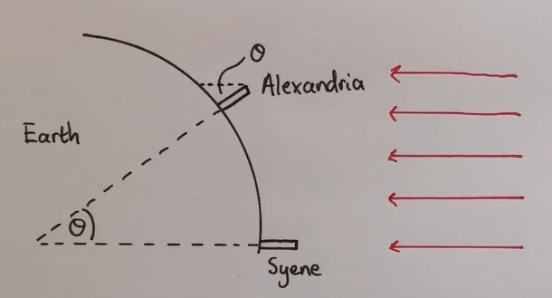

# Aber zuerst ...

# Verfassungsviertelstunde!!!!

---

Das Grundgesetz für die Bundesrepublik Deutschland schützt die Freiheit, Würde und informationelle Selbstbestimmung des Einzelnen. Digitale Unabhängigkeit wird so zu einer praktischen Umsetzung der im Grundgesetz verankerten Freiheitsrechte im digitalen Raum.

Was ist *Digitale Unabhängigkeit* eigentlich?

---

# Wie alles begann ..

## 600 v.Ch - China

:::{.smaller}
Der Schöpferriese Phan Ku schlüpft aus einem Ei. Er schuf die Welt,
indem er mit einem Meißel Täler in in die Landschaft schlug und Berge 
errichtete. Dann setzte er Sonne, Mond und Sterne an den Himmel und starb.

Sein Tod ist Teil der Schöpfung, sein Schädel wurde zum Himmelsgewölbe, 
sein Fleisch der Erdboden, seine Knochen die Steine und sein Blut die 
Flüsse und Seen. Sein letzter Atemhauch schuf Wolken und Wind und sein 
Schweiß wurde der Regen.

Sein Haar fiel zur Erde und wurde zu Planzen und aus den Flöhen, die
in seinem Haar hausten, wurde die Menschheit.

Da unsere Geburt den Tod des Schöpfers erforderte, stehen wir unter dem 
ewigen Fluch von Kummer und Leid.
:::

## Die Edda -- Island

:::{.smaller}
Ein gähnender Abgrund trennte die gegensätzlichen Reiche Muspellsheim 
(Feuer und Hitze) und Niflheim (Schnee und Kälte).

Die Hitze schmolz das Eis und das Wasser tropfte in die Schlucht.
Dort entstand das Leben in Form des Riesen Ymir. Damit begann die Schöpfung 
der Welt.
:::

## Das Volk der Krachi -- Westafrikanische Togo
:::{.smaller}
Der riesige blaue Gott Wulbari (=Himmel) befand sich ein Stück über der Erde.
Eine Frau stampfte mit einem langen Stab Getreide und störte ihn, so dass er
höher stieg. Die Menschen ließen ihn nicht in Ruhe und verwendeten Teile
von ihm als Handtücher oder als Würze ihrer Suppe.
Daraufhin stieg er in unerreichbare Höhen (aktueller Stand).
:::

## Das Volk der Yoruba (Westafrika)
:::{.smaller}
Olrun war der Besitzer des Himmels, die Erde war trostloses Sumpfland.
Er schickte eine Muschel hinab zur Erde, die eine Henne, eine Taube und etwas 
Erdreich enthielt. Das Erdreich wurde verteilt und Henne und Taube 
pickten und scharrten so lange, bis sich das Sumpfland verfestigte.
Zur Kontrolle schickte Olrun das blaue Chamäleon zur Erde, das sich dabei
braun verfärbte, als Zeichen, dass die Umwandlung gelungen war.
:::

## Griechenland
:::{.smaller}
Sonne ist ein Feuerwagen, der vom Gott Helios über den Himmel gejagt wird.
...
:::

# Erkenntnis

Alle Schöpfungsmythen

:::{.incremental}
* spiegeln Gesellschaft und Umwelt wider
* enthalten (mindestens) ein übernatürliches Wesen
* sind absolute Wahrheit für die jeweilige Gesellschaft
:::
::: {.fragment}
Zweifel wurden als Ketzerei betrachtet.  
(Allerdings ist der Begriff *Ketzerei* christlich geprägt -- Häresie ist treffender).
:::

# Wie es weiter ging ...

## Griechenland

Ab 600 v.Chr wird es liberaler

:::{.incremental}
* Philosopie darf eigene, abweichende Erklärungen des Universums erfinden.
* Es wurden auch Erklärungen ohne Götter gefunden
:::

---

### Beispiele

---

**Anaximandros von Milet**  
Die Sonne ist ein Loch in einem feuergefüllten Ring,
der sich um die Erde dreht. Mond und Sterne sind ebenfalls Löcher.

---

**Xenophanes von Kolophon**  
Die Erde dünstet brennbare Gase aus, die sich 
nachts sammeln und nach dem Erreichen einer kritischen Masse entzünden
und die Sonne bilden. Ist die Gaskugel verbrannt, ist Nacht. Sterne 
sind Restfunken. Der Mond entsteht aus anderen Gasen, die in einem 
28-Tage Zyklus entstehen und abbrennen.

---

**Fazit**  

::: {.fragment}
Die Griechen glaubten, dass das Universum verstanden werden kann.
:::
::: {.fragment}
Versuche beginnen, die mathematischen Regeln hinter den Himmelskörpern 
zu finden (Pythagors, 540 v.Ch).
:::

---

**Blöd gelaufen**  

[500 vCh Philalos ... 310 vCh:   
Aristarchos beschreibt ein exaktes Heliozentrisches Weltbild (incl. Erdrotation).]{.fragment}

[Problem:   
Das Weltbild widerspricht dem gesunden Menschenverstand und wird verworfen - für 1500 Jahre.]{.fragment}

---

**Erkenntnisse**  

Die Erde ist eine Kugel, denn

:::{.incremental}
* Schiffe verschwinden am Horizont
* Mond ist rund - warum nicht auch die Erde
* Erdschatten bei Mondfinsternis ist ebenfalls rund
:::

::: {.fragment}
Immer noch Erde als Zentrum, Mittelpunkt, da niemand „runter“ fällt.
:::

---

### Berechnungen

**Erdumfang**  

:::::: {.columns}
::: {.column}
::: {.fragment}

:::

:::
::: {.column}
::: {.incremental .smaller}
* gemessener Winkel: $7,2^\circ$
* $7,2^\circ = \frac{1}{50} \cdot 360^\circ$
*  Abstand von Seyne - Alexandria ist $\frac{1}{50}$ Erdumfang
:::

:::
:::
<!-- end columns -->

::: {.fragment}

**Wichtig**  
Die Methode ist korrekt, Abweichungen sind Messfehler!
:::

---

**Weitere Schritte**

:::{.incremental}
* Durchmesser Mond
* Abstand Erde-Mond
* Durchmesser Sonne
* Abstand Erde-Sonne
* ...
:::

## Babylonier

Keine Wissenschaftler (da Erklärung durch Götter) aber Numbercruncher.

## Ägypter

:::{.incremental}
[Techniker, Ingenieure aber keine Naturwissenschaftler.]{.fragment}

[Technik hat das Ziel, das Leben „besser zu machen“ - Naturwissenschaft
will Neugierde befriedigen und keine Bequemlichkeit.]{.fragment}

[Die Grenze zwischen Naturwissenschaftler und Techniker kann verschwimmen.]{.fragment}
:::

# Nach dem Jahre 0

## Ptolemäus (2. Jhd)

:::{.incremental}
[Der Mars läuft RÜCKWÄRTS????]{.fragment}  
[Kreise auf Kreisbahnen auf Kreisbahnen -- Zyklen und Epizyklen]{.fragment}  
[Völlig falsch, aber extrem genau]{.fragment}  
:::

## Kopernikus

:::{.incremental}
[1473 Polen, Ausbildung Kirchenrecht und Medizin in  Italien.]{.fragment}  
[Gelangweilter Leibarzt seines Onkels]{.fragment}  
[Erstes Werk (20 Seiten, 1514) , damals kaum gelesen]{.fragment}  
[Erstellt Postulate]{.fragment}  
[]{.fragment}  
[]{.fragment}  
:::

---

**Postulate**  

:::{.incremental .smaller}
[Die Himmelskörper haben keinen gemeinsamen Mittelpunkt]{.fragment}  
[Der Mittelpunkt der Erde ist nicht der Mittelpunkt des Universums.]{.fragment}  
[Der Mittelpunkt des Universums liegt in der Nähe der Sonne.]{.fragment}  
[Der Abstand Erde-Sonne ist winzig im Vergleich zum dem zu den Sternen]{.fragment}  
[Die scheinbare tägliche Bewegung der Sterne kommt von der Erdrotation]{.fragment}  
[Die scheinbare Sternenbewegung im Jahreszyklus kommt von der Bewegung der
   Erde um die Sonne.]{.fragment}  
[Die scheinbare Rückwärtsbewegung mancher Planeten ist die Folge der
   Erdbewegung.]{.fragment}  
:::

## Drama um Kopernikus

:::{.incremental .smaller2}
[30 Jahre Verfeinerung, 200 Seiten ]{.fragment}  
[Angst vor Veröffentlichung wegen Kirche.]{.fragment}  

[1539 Rhetikus (25 Jahre alt) bestärkt ihn und bringt es 1541 in die Druckerei.]{.fragment}  

[Wollte Druck beaufsichtigen, musste weg, Osiander übernimmt.
Veröffentlichung 1543.]{.fragment}   

[Kopernikus (bettlägrig) bekommt das Buch 
übergeben]{.fragment} [und stirbt]{.fragment}  

[**Gründe**]{.fragment}  
[Rhetikus fehlt in der Danksagung und ist beleidigt - Könnte an 
„Protestant“ gelegen haben.]{.fragment}  

[Ohne Wissen von Kopernikus wurde ein Vorwort eingefügt, das den
Inhalt seines Werkes zum „hypothetischen Gedankenspiel“ herunterstuft.]{.fragment}  

[Verdacht: Osiander wollte Kopernikus schützen, Folge: Das Buch
findet kaum Beachtung, und hat 100 Jahre keine Wirkung.]{.fragment}  

[Angst vor der Kirche war begründet: Giordano Bruno wurde für ähnliche Aussagen von der Kirche ermordet.]{.fragment}  
:::

---

## Tycho Brahe

:::{.incremental .smaller2}
[1546 Dänemark, 1566 Duell mit Cousin wegen Prophezeihung]{.fragment}  
[Nase als Gold-Silber-Kupfer  ]{.fragment}   

[Neu Präzision beim Beobachten. König Friedrich II von Dänemark
überlässt ihm die Insel Hven (Schloss Uranienborg).]{.fragment}  

[Feiert gerne, hat einen Elch als Haustier]{.fragment}  
[Elch fällt betrunken die Treppe hinunter -- tot]{.fragment}  

[1588 stirbt FII, Brahe muss umziehen, landet in Prag, schließt sich
mit Johannes Kepler zusammen.]{.fragment}  
:::

## Tycho Brahe

:::{.incremental .smaller2}
[1601 Tycho stirbt aus Höflichkeit]{.fragment}  
[Kepler erbt sein Daten]{.fragment}  
[Plant Lösung des Mars-Problems in 8 Tagen]{.fragment}  
[Schafft es nach 8 Jahren]{.fragment}  
:::

## Galileo Galilei
:::{.incremental .smaller2}
[1564, Pisa]{.fragment}   
[1608 Kontakt mit dem Fernrohr, entwickelt es weiter]{.fragment}  
[Bestätigt durch Beobachtung die Rechnungen von Kepler]{.fragment}  
[Schreibt ein Buch darüber]{.fragment}  
[Ärger mit der Kirche]{.fragment}  
[Hausarrest]{.fragment}  
[1992 Entschuldigung der Kirche]{.fragment}
:::

:::{.smaller}

:::

:::{.smaller}

:::